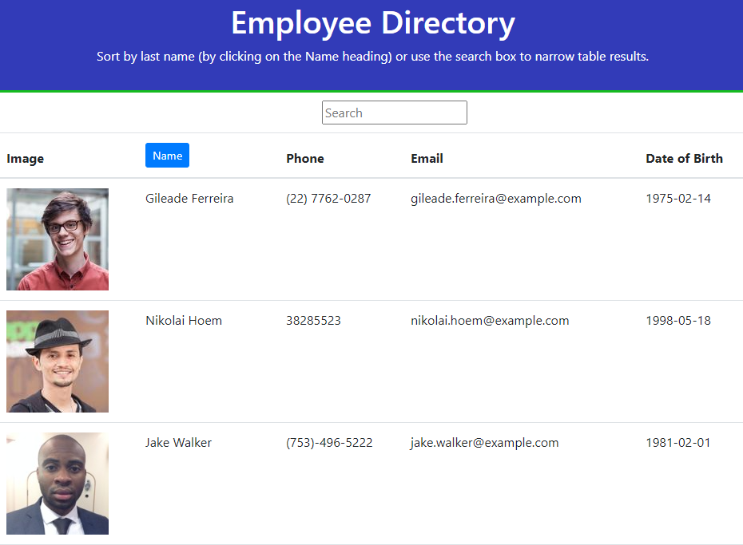

# Employee Directory

View the deployed page on [GitHub](https://dawisen.github.io/employee-directory/)

## Description 
Employees and managers would like to be able to view non-sensitive information about other employees easily from their company website. Employee Directory is a React application that allows users to display employee information and dynamically update the directory with data from a connected API or database. Whenever the database is updated, those changes are reflected on the page with current employee data. The days of redeploying directory pages every time you need to update or delete employee information are over!
For demo purposes, Employee Directory uses the API [Random User Generator](https://randomuser.me/) to simulate data being retrieved from a database. This application also allows users to organize the results alphabetically by last name. Simply click on the name header to change the order of employee results.
## Table of Contents

* [Installation](#Installation)
* [Usage](#Usage)
* [License](#License)
* [Contributing](#Contributing)
* [Testing](#Testing)
* [Questions](#Questions)

## Installation
While inside the root directory run this command in the terminal
>npm i
  
## Usage
To use the repo, fork it to your github page or clone the repository.

## License

## Contributors
dawisen

## Testing
no tests available
  
## Questions
If you have any questions or issues please contact me via [email](daniellewwise@gmail.com) 
View my other projects [here](https://github.com/dawisen?tab=repositories)
